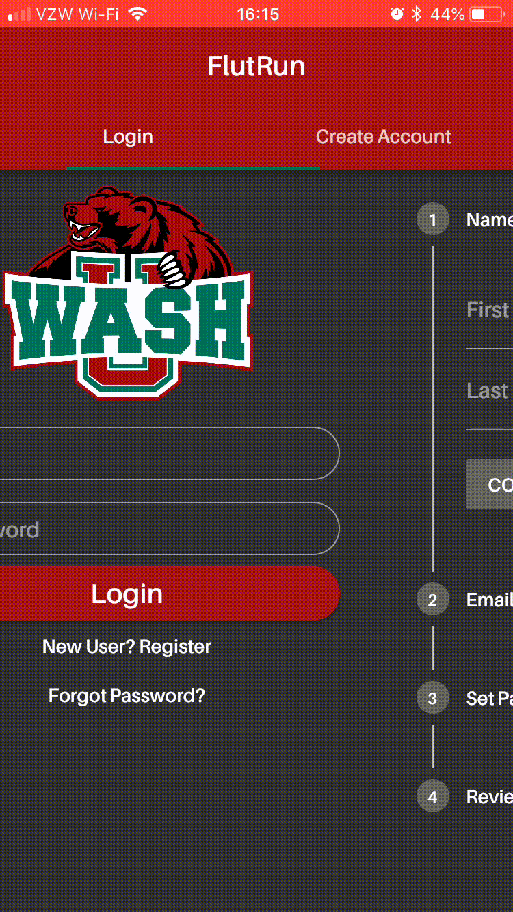
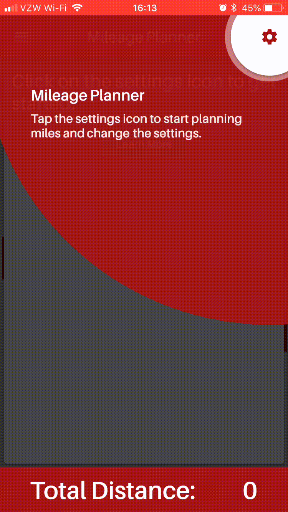
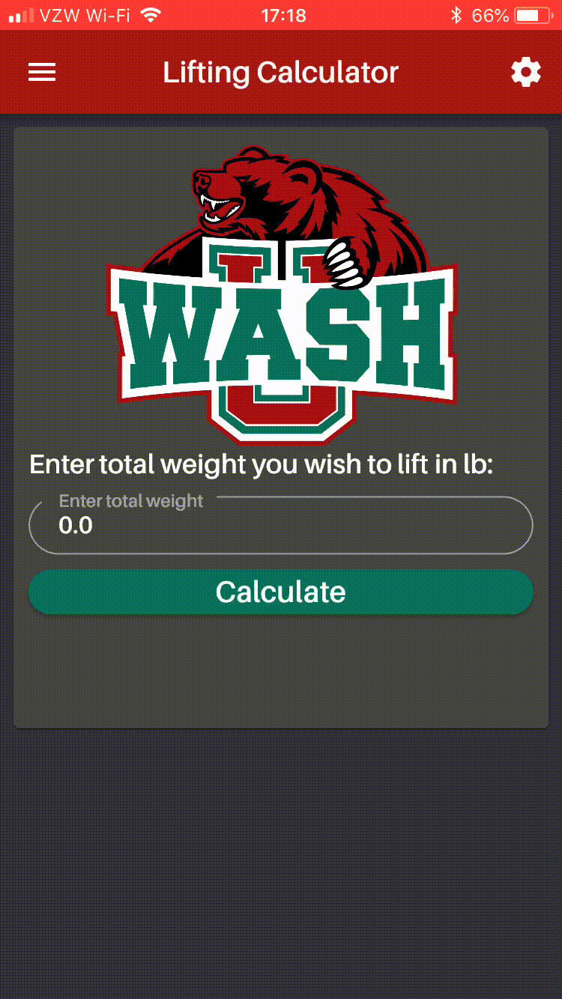

# flut_run

Personal project using Flutter framework and Dart API. This app is designed to bring the running community together and serve as a useful team tool.

## Overview

  
    

      This app is designed for running teams, the target group is high school, college and club teams. It offers many tools and features to help bring teams together and help them learn more about the art of running. The main features of the app include the following: mileage planner, mileage log, split calculator, message board, lifting calculator, and a race predictor. The goal of the app is to provide teams with a useful running tool that promotes learning and giving back to the running community. I hope to be able to finish the app and deploy it on both Apple App Store and Google Play Store. The plan is to have coaches or captains register teams accounts and send a unique cmaode to the rest of the team where they will be able to make their own account on a customized team app. The app will have the teams logo and colors throughout the app. 

The app offers many features in order to provide a good user experience. The app can be customized to any team.

The user experiences a slash screen before being sent to the root page where it is determined if they get sent to the login page or home page.
    

  
  
    
  

The login page uses firebase to authorize the user, and allows new users to register an account.

## App Features
One of the primary features of this app is a mileage planner tool. This tool allows users to quickly plan out how far they are trying to run each day for a given weekly total mileage.  

Another feature the app offers is a split calculator. This lets users plan out their race splits quickly and efficiently.

Lifting calculator allows users to determine how much weight to put on either side of the bar for specified target weight.

The about section tells users about the app. It covers the goal of the app and the history behind it.

