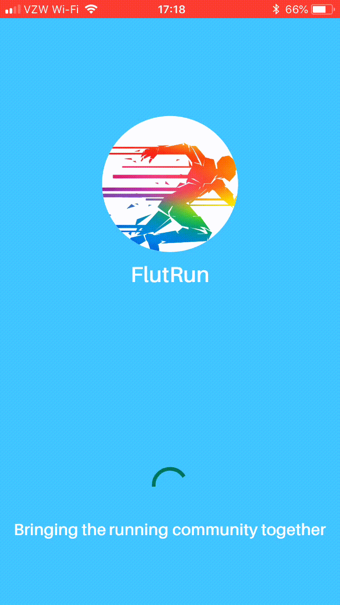

# flut_run

Flutter Application designed to bring the running community together and serve as a useful team tool.

## Overview

The app offers many features in order to provide a good user experience. The app can be customized to any team.

In addition to this the app provides a mileage planner tool in order to quickly plan out how far a runner is trying to run each day for a given weekly total mileage. 

